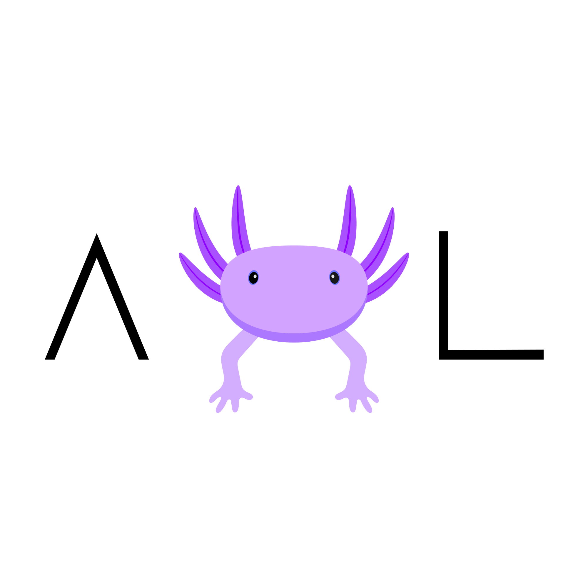

<div align="center">
  
</div>

### More About Language

The language is
designed primarily as
`event-driven` and
`object-oriented`.
The combination of the two paradigms will greatly simplify the design of the architecture of your programs while
respecting the provided conventions

Example:

````kotlin
@main(args: List< String >) {
    raise Message ("Hello, world!")
}

@listener(event: Message) {
    println(event.getMessage())
}

@event
ref Message {

    @getter
    var message: String

    @public
    @new(message: String) {
        this.message = message
    }
}

````

### Frequently asked questions

Question:
> Is it worth developing large projects on Axolotl when releasing dev versions?

Answer:
> – Only if you are familiar with the list of approved designs that will be able to support backwards compatibility

